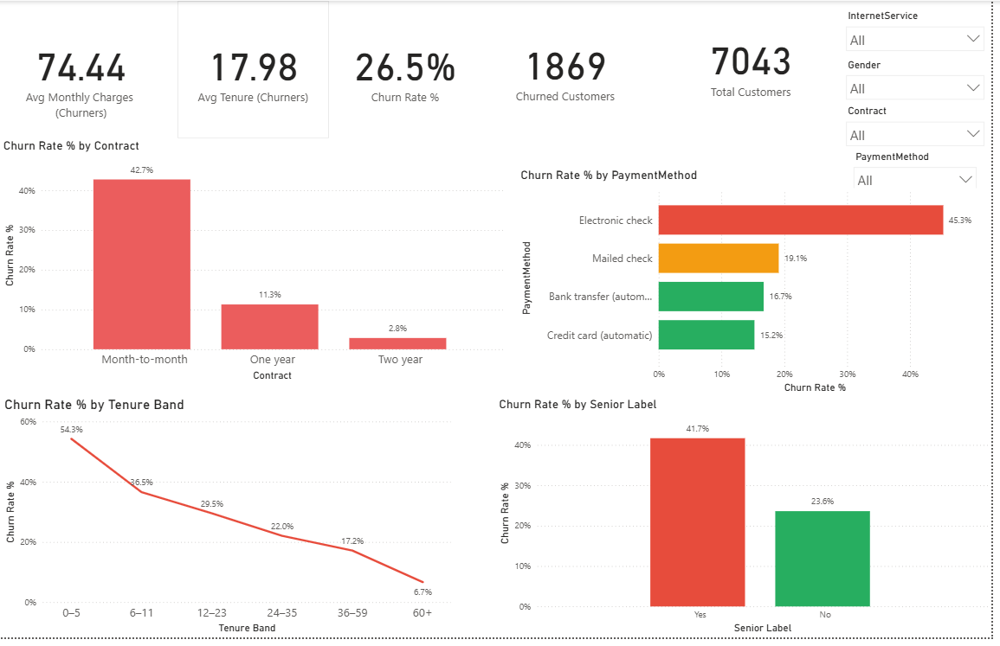

# Telco Churn Prediction (ML + BI)

📊 End-to-end Telco Customer Churn project combining **Python (ML)** + **SQL** + **Power BI**.

---

## 🔹 Project Overview
- Cleaned and prepared the Telco churn dataset.  
- Performed EDA with **Python** (pandas, seaborn, matplotlib).  
- Ran **SQL queries** inside Jupyter for churn insights.  
- Built and compared **ML models**: Logistic Regression, Random Forest, XGBoost.  
- Evaluated with metrics: Accuracy, Precision, Recall, F1, ROC-AUC.  
- Created an **interactive Power BI dashboard** for business users.

---

## 🔹 Key Results
- **Churn Rate**: ~26.5% of customers  
- **Best Model**: Random Forest → Accuracy **78.9%**, ROC-AUC **83%**  
- **Main Drivers of Churn**:  
  - Month-to-month contracts  
  - Electronic check payments  
  - Senior citizens  

---

## 🔹 Dashboard Preview
Power BI dashboard with churn KPIs, risk segmentation, and filters:

---

## 📂 Repository Structure  

- `bi/` → Power BI dashboard  
  - `telco_churn_dashboard.pbix` → Power BI file  
  - `telco_churn_dashboard.png` → PNG preview  

- `notebooks/` → Jupyter Notebook for EDA + SQL queries  
  - `telco-churn-eda.ipynb`

- `outputs/` → Processed data, model results, and saved model  
  - `telco_churn_clean.csv`  
  - `model_results.csv`  
  - `scored_all_customers_testset.csv`  
  - `at_risk_customers_testset_threshold_0_40.csv`  
  - `best_churn_model.joblib`  

- `requirements.txt` → Python dependencies
- `Telco_Churn_Prediction_Retention_Documentation.docx` → Complete business, analytical & technical documentation  
- `README.md` → Project documentation (this file)  
- `LICENSE` → Open-source license  
- `.gitignore` → Git ignore rules
  
---

## 📄 Documentation

Full project documentation detailing the business, analytical, and technical aspects is available here:  
[📘 Download Telco_Churn_Prediction_Retention_Documentation.docx](./Telco_Churn_Prediction_Retention_Documentation.docx)

**Includes:**
- Business problem, goals, and data overview  
- Feature engineering, model selection, and performance comparison  
- Retention strategy insights derived from churn predictors  
- Power BI dashboard explanation and business interpretation  
- ROI metrics, impact summary, and improvement roadmap  

---

## 🛠️ Tools & Technologies  
- **Python**: pandas, seaborn, matplotlib, scikit-learn, xgboost  
- **SQL**: queries inside Jupyter Notebook for churn analysis  
- **Power BI**: dashboard creation for interactive insights  
- **GitHub**: version control and project documentation  

---
## 🔹 How to Run

1. **Clone the repo**  
   git clone https://github.com/Anu779930/telco-churn-ml-bi.git  

2. **Install dependencies**  
   pip install -r requirements.txt  

3. **Run the Jupyter Notebook** for EDA, SQL queries, and ML modeling.  

4. **Open the Power BI dashboard** (`bi/telco_churn_dashboard.pbix`) to explore interactive churn KPIs.  

---

## 📜 License
This project is licensed under the MIT License.
